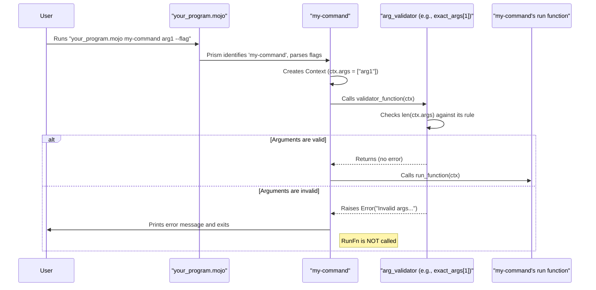

# Chapter 6: Argument Validators

Welcome back! In [Chapter 5: Context](05_context_.md), we learned about the `Context` object, which provides our command's `run` function with a list of positional arguments (`ctx.args`). These are the arguments users type after your command's name and its flags. For example, in `my_tool copy source.txt destination.txt`, "source.txt" and "destination.txt" are positional arguments.

But what if your command *needs* a specific number of these arguments? What if `copy` absolutely requires two arguments – a source and a destination? If a user forgets one, your command might crash or behave unexpectedly later on. This is where **Argument Validators** step in!

## The Bouncers of Your Command's Party

Think of `Argument Validators` as the bouncers for your command's party. Your command is the party, and the positional arguments are the guests trying to get in.
*   Flags (`--verbose`, `-o file`) are like VIPs who have already been checked at a special entrance.
*   The bouncer (Argument Validator) then looks at the remaining guests (positional arguments) waiting in line.
*   They have a guest list with rules: "Exactly two guests allowed," or "No guests allowed today," or "At least one guest, but no more than three."

If the "guests" (positional arguments) don't match the rules on the "guest list" (the validator's criteria), the bouncer stops them at the door, explains the rule, and doesn't let them into the party (your command's `run` function). This prevents problems *before* your main command logic even starts.

Argument Validators ensure that the positional arguments passed to your command meet predefined criteria. If they don't, Prism stops the command and informs the user, leading to a much better user experience.

## Using Built-in Argument Validators

Prism provides several ready-to-use argument validators. You tell a `Command` which validator to use with its `arg_validator` parameter.

Let's say we're building a `show-file` command that needs *exactly one* argument: the name of the file to show.

```mojo
from prism import Command, Context, exact_args // ✨ Import exact_args

// This function expects one filename from ctx.args
fn display_file_content(ctx: Context) -> None:
    let filename = ctx.args[0] // We're now confident ctx.args has at least one item
    print("Showing content of:", filename[])
    // ... actual file reading logic would go here ...

fn main():
    var show_cmd = Command(
        name="show-file",
        usage="Displays the content of a single file.",
        run=display_file_content,
        arg_validator=exact_args[1]() // ✨ Use exact_args validator!
    )
    show_cmd.execute()
```

Let's break this down:
1.  We import `exact_args` from `prism`.
2.  When defining `show_cmd`, we set `arg_validator=exact_args[1]()`.
    *   `exact_args` is a function that *returns* an argument validator function.
    *   The `[1]` part is a compile-time parameter telling `exact_args` that we expect exactly 1 argument.
    *   The `()` at the end calls the function to get the actual validator.

Now, let's see how this "bouncer" works. Save the code as `file_viewer.mojo`.

*   **Correct Usage:**
    ```sh
    mojo run file_viewer.mojo show-file my_document.txt
    ```
    Output:
    ```
    Showing content of: my_document.txt
    ```
    The bouncer saw one guest ("my_document.txt"), the rule was "exactly one," so it let the guest in!

*   **Incorrect Usage: No arguments**
    ```sh
    mojo run file_viewer.mojo show-file
    ```
    Prism will stop and print an error similar to:
    ```
    Error: The command `show-file` accepts exactly 1 argument(s). Received: 0.
    ```
    The bouncer saw zero guests, but the rule was "exactly one." Access denied!

*   **Incorrect Usage: Too many arguments**
    ```sh
    mojo run file_viewer.mojo show-file doc1.txt doc2.txt
    ```
    Prism will stop and print an error like:
    ```
    Error: The command `show-file` accepts exactly 1 argument(s). Received: 2.
    ```
    The bouncer saw two guests, but the rule was "exactly one." Access denied again!

Thanks to `exact_args[1]()`, our `display_file_content` function can safely assume `ctx.args[0]` exists because the validator guarantees it.

## Common Argument Validators in Prism

Prism comes with a handy set of validators (found in `src/prism/args.mojo` and re-exported in `prism/__init__.mojo`):

*   **`no_args`**:
    *   Rule: No positional arguments allowed.
    *   Usage: `arg_validator=no_args`
    *   Example: A command like `ping-server` that doesn't need any extra info.
    ```mojo
    from prism import Command, Context, no_args

    fn ping_action(ctx: Context) -> None:
        print("Pinging the server...")

    fn main():
        var ping_cmd = Command(
            name="ping-server",
            usage="Pings the main server.",
            run=ping_action,
            arg_validator=no_args // No arguments allowed
        )
        ping_cmd.execute()
    ```
    Running `mojo run my_app.mojo ping-server an_arg` would fail.

*   **`exact_args[N]()`**:
    *   Rule: Exactly `N` positional arguments.
    *   Usage: `arg_validator=exact_args[2]()` (for exactly 2 arguments).
    *   We saw this with `show-file`.

*   **`minimum_n_args[N]()`**:
    *   Rule: At least `N` positional arguments.
    *   Usage: `arg_validator=minimum_n_args[1]()` (for at least 1 argument).
    *   Example: A `sum` command that needs at least one number to sum.
    ```mojo
    from prism import Command, Context, minimum_n_args

    fn sum_numbers(ctx: Context) -> None:
        print("Summing up", len(ctx.args), "numbers...")
        // ... logic to sum numbers in ctx.args ...

    fn main():
        var sum_cmd = Command(
            name="sum",
            usage="Sums one or more numbers.",
            run=sum_numbers,
            arg_validator=minimum_n_args[1]() // At least one number
        )
        sum_cmd.execute()
    ```

*   **`maximum_n_args[N]()`**:
    *   Rule: At most `N` positional arguments.
    *   Usage: `arg_validator=maximum_n_args[3]()` (for 0, 1, 2, or 3 arguments).

*   **`range_args[MIN, MAX]()`**:
    *   Rule: Between `MIN` and `MAX` arguments (inclusive).
    *   Usage: `arg_validator=range_args[1, 2]()` (for 1 or 2 arguments).

*   **`arbitrary_args`**:
    *   Rule: Any number of arguments allowed (including zero).
    *   Usage: This is the **default validator** if you don't specify an `arg_validator` for your `Command`.
    *   `arg_validator=arbitrary_args`

*   **`valid_args`**:
    *   Rule: All positional arguments must be from a predefined list.
    *   You define this list in your `Command` using the `valid_args` parameter.
    *   Usage: `arg_validator=valid_args`
    ```mojo
    from prism import Command, Context, valid_args

    fn set_mode(ctx: Context) -> None:
        print("Mode set to:", ctx.args[0][])

    fn main():
        var mode_cmd = Command(
            name="set-mode",
            usage="Sets the application mode.",
            run=set_mode,
            // Define which arguments are acceptable
            valid_args=List[String]("fast", "eco", "debug"),
            arg_validator=valid_args // Use the validator
        )
        mode_cmd.execute()
    ```
    Running `mojo run my_app.mojo set-mode slow` would fail because "slow" is not in `valid_args`.
    Note: `valid_args` by itself doesn't enforce the *number* of arguments, only their *values*. You might combine it using `match_all` (see below).

*   **`match_all[*validators]()`**:
    *   Rule: Combines multiple validators. All must pass.
    *   Usage: `arg_validator=match_all[exact_args[1](), valid_args]()` (exactly one argument, AND that argument must be from the `valid_args` list).
    ```mojo
    from prism import Command, Context, exact_args, valid_args, match_all

    fn set_color(ctx: Context) -> None:
        print("Color set to:", ctx.args[0][])

    fn main():
        var color_cmd = Command(
            name="set-color",
            usage="Sets the primary color (red, green, or blue).",
            run=set_color,
            valid_args=List[String]("red", "green", "blue"),
            // Enforce exactly one argument, AND it must be one of the valid_args
            arg_validator=match_all[exact_args[1](), valid_args]()
        )
        color_cmd.execute()
    ```

## Under the Hood: How Validators Work

When you call `my_command.execute()`, and after Prism has identified the command and parsed any flags, it's time for the argument validator to do its job.

Here's the sequence:
1.  **Command Execution Starts**: You run `mojo run my_app.mojo my-command arg1 arg2 --flag`.
2.  **Command Identification**: Prism figures out `my-command` is the one to run.
3.  **Flag Parsing**: Flags like `--flag` are processed by the command's [FlagSet](03_flagset_.md).
4.  **Context Creation**: A [Context](05_context_.md) object (`ctx`) is created. At this point, `ctx.args` contains the leftover positional arguments (e.g., `["arg1", "arg2"]`).
5.  **Argument Validation**: *Before* any pre-run hooks or your main `run` function, Prism calls the `arg_validator` function associated with `my-command`, passing it the `ctx`.
    ```mojo
    // Conceptual: Inside Command.execute()
    // ... after flags are parsed and context is created ...
    var ctx = Context(positional_args_after_flags, command_ptr)

    // Call the validator!
    try:
        command_ptr[].arg_validator(ctx) // e.g., exact_args[1]()(ctx)
    except e:
        self.exit(e) // If validator raises an error, print it and exit
        return

    // ... if no error, proceed to pre_run, run, post_run ...
    ```
6.  **Validator Logic**: The validator function (e.g., `exact_args[1]()`) inspects `ctx.args`.
    *   If `len(ctx.args)` is not 1, it `raise`s an `Error` with a descriptive message.
    *   If `len(ctx.args)` is 1, it does nothing and simply returns.
7.  **Outcome**:
    *   If the validator raises an error, Prism catches it, prints the error message, and exits. Your command's `run` function is never called.
    *   If the validator returns without error, Prism proceeds to execute pre-run hooks and then your command's `run` function.

Here's a simplified sequence diagram:



### A Peek at the Validator Code (`src/prism/args.mojo`)

Argument validators are functions that take a `Context` and can `raise` an `Error`. Their type is defined by the `ArgValidatorFn` alias:

```mojo
// From src/prism/args.mojo
alias ArgValidatorFn = fn (ctx: Context) raises -> None
```

Let's look at a simplified version of `exact_args`:

```mojo
// Simplified from src/prism/args.mojo

// This is a function that RETURNS an ArgValidatorFn
fn exact_args[n: UInt]() -> ArgValidatorFn:

    // This is the actual validator function that will be called by Prism
    fn exactly_n_args(ctx: Context) raises -> None:
        if len(ctx.args) != n: // 'n' is captured from the outer function
            raise Error(
                "The command `",
                ctx.command[].name, // Access command name via Context
                "` accepts exactly ",
                n,
                " argument(s). Received: ",
                len(ctx.args),
                "."
            )
        // If the number of args is correct, do nothing (implicitly passes)

    return exactly_n_args // Return the configured validator function
```
When you write `arg_validator=exact_args[1]()`:
1.  `exact_args[1]()` is called. The `n` inside it becomes `1`.
2.  It creates and returns the inner function `exactly_n_args`, where `n` is fixed to `1`.
3.  This returned `exactly_n_args` function is what gets stored in your `Command`'s `arg_validator` field.
4.  Later, Prism calls this stored `exactly_n_args` function with the `Context`.

The `Command` struct stores this validator:
```mojo
// Simplified from src/prism/command.mojo
@value
struct Command:
    // ... other fields ...
    var arg_validator: ArgValidatorFn
    var valid_args: List[String] // Used by the 'valid_args' validator

    fn __init__(
        out self,
        // ... other params ...
        arg_validator: Optional[ArgValidatorFn] = None,
        valid_args: List[String] = List[String](),
        // ...
    ):
        // ...
        if arg_validator:
            self.arg_validator = arg_validator.value()
        else:
            self.arg_validator = arbitrary_args // Default validator
        self.valid_args = valid_args
        // ...
```
If you don't provide an `arg_validator`, it defaults to `arbitrary_args`, which allows any number of arguments.

## Conclusion

Argument Validators are your command's first line of defense for positional arguments. They act like helpful bouncers, ensuring that your command receives the correct number and type of arguments *before* your main logic runs. This leads to:
*   **Safer Code**: Your `run` function can often make stronger assumptions about `ctx.args`.
*   **Better User Experience**: Users get clear, early feedback if they misuse your command, instead of cryptic errors later.
*   **Cleaner Command Logic**: You don't need to clutter your `run` function with argument count checks.

Prism provides a suite of built-in validators like `no_args`, `exact_args`, `minimum_n_args`, and more, making it easy to define the "guest list" for your command's arguments.

While Argument Validators check positional arguments, what if you have complex rules for your *flags*? For example, "flag A and flag B must be used together" or "flag X and flag Y cannot be used at the same time." That's where [Chapter 7: Flag Groups](07_flag_groups_.md) come into play!

---

Generated by [AI Codebase Knowledge Builder](https://github.com/The-Pocket/Tutorial-Codebase-Knowledge)