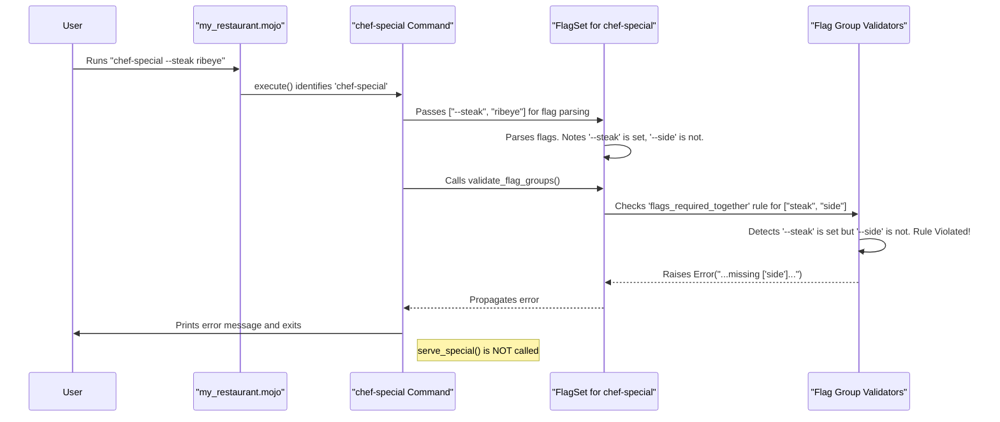

# Chapter 7: Flag Groups

Welcome to the final chapter of our core Prism tutorial! In [Chapter 6: Argument Validators](06_argument_validators_.md), we learned how to set rules for the positional arguments our commands accept. But what about the flags themselves? Sometimes, flags don't operate in isolation; they have relationships with each other. That's where **Flag Groups** come in.

Imagine you're at a restaurant. The menu (your CLI) has items (flags) with special conditions:
*   "If you order the steak (`--steak`), you *must* also order a side (`--side`)." These two are **required together**.
*   "For your starter, you can have either soup (`--soup`) or salad (`--salad`), but *not both*." These are **mutually exclusive**.
*   "You *must* pick at least one appetizer from this section: `--wings`, `--nachos`, or `--fries`." Here, **one is required** from the group.

Flag Groups in Prism allow you to define these kinds of rules for how multiple flags can (or cannot) be used together. This system, managed by the command's [FlagSet](03_flagset_.md), ensures users provide valid combinations of flags, making your CLI more robust and user-friendly.

## Types of Flag Group Rules

Prism supports three main types of flag group rules:

1.  **Flags Required Together**: If any flag from a specified group is used, then *all* flags in that group must be used. (Like our steak and side example).
2.  **Mutually Exclusive Flags**: If any flag from a specified group is used, then *no other* flag from that same group can be used. (Like the soup or salad choice).
3.  **One Required Flag**: At least one flag from a specified group *must* be used by the user. (Like choosing an appetizer).

Let's see how to implement these rules for our commands.

## Setting Up Your Menu: Defining Flag Groups

You define these flag group rules directly when you create your `Command`, using specific parameters:

*   `flags_required_together`: A list of flag names that must all be present if any one of them is used.
*   `mutually_exclusive_flags`: A list of flag names where only one can be chosen.
*   `one_required_flags`: A list of flag names where at least one must be chosen.

Let's build some examples.

### 1. Flags Required Together: The "Steak and Side" Combo

Imagine a `chef-special` command. If the user orders the `--steak`, they must also specify a `--side`.

First, let's define the flags:
```mojo
from prism import Command, Context, Flag

fn serve_special(ctx: Context) -> None:
    if ctx.command[].flags.get_string("steak"):
        let steak_type = ctx.command[].flags.get_string("steak").value()
        let side_dish = ctx.command[].flags.get_string("side").value()
        print("Serving", steak_type, "steak with a side of", side_dish, "!")
    else:
        print("No special ordered.")

// Define the flags themselves
var steak_flag = Flag.string(name="steak", usage="Type of steak (e.g., ribeye)")
var side_flag = Flag.string(name="side", usage="Choice of side dish (e.g., fries)")
```
Now, let's create the command and tell Prism that `--steak` and `--side` are required together. The rule applies if *any* of them are used.

```mojo
// ... (previous flag definitions and serve_special function)

fn main():
    var special_cmd = Command(
        name="chef-special",
        usage="Order the chef's special meal.",
        run=serve_special,
        flags=List[Flag](steak_flag, side_flag),
        // ✨ Rule: --steak and --side must be used together
        flags_required_together=List[String]("steak", "side")
    )
    special_cmd.execute()
```
In the `Command` constructor, we set `flags_required_together=List[String]("steak", "side")`.

Let's see how it behaves:

*   `mojo run my_restaurant.mojo chef-special --steak ribeye --side fries`
    Output: `Serving ribeye steak with a side of fries!` (Correct!)

*   `mojo run my_restaurant.mojo chef-special --steak ribeye`
    Prism Output: `Error: If any flags in the group ["side", "steak"] are set they must all be set; missing ["side"].` (User forgot `--side`)

*   `mojo run my_restaurant.mojo chef-special --side salad`
    Prism Output: `Error: If any flags in the group ["side", "steak"] are set they must all be set; missing ["steak"].` (User forgot `--steak`)

*   `mojo run my_restaurant.mojo chef-special`
    Output: `No special ordered.` (Correct! The rule only applies if one of them is used.)

### 2. Mutually Exclusive Flags: "Soup or Salad?"

Let's create a `choose-starter` command. The user can have `--soup` or `--salad`, but not both.

```mojo
from prism import Command, Context, Flag

fn order_starter(ctx: Context) -> None:
    if ctx.command[].flags.get_bool("soup").value_or(False):
        print("One soup, coming up!")
    elif ctx.command[].flags.get_bool("salad").value_or(False):
        print("Salad it is!")
    else:
        print("No starter selected.")

var soup_flag = Flag.bool(name="soup", usage="Order soup")
var salad_flag = Flag.bool(name="salad", usage="Order salad")

fn main():
    var starter_cmd = Command(
        name="choose-starter",
        usage="Select your starter.",
        run=order_starter,
        flags=List[Flag](soup_flag, salad_flag),
        // ✨ Rule: --soup and --salad cannot be used together
        mutually_exclusive_flags=List[String]("soup", "salad")
    )
    starter_cmd.execute()
```
Here, `mutually_exclusive_flags=List[String]("soup", "salad")` enforces our rule.

Testing it:

*   `mojo run my_restaurant.mojo choose-starter --soup`
    Output: `One soup, coming up!` (Correct!)

*   `mojo run my_restaurant.mojo choose-starter --salad`
    Output: `Salad it is!` (Correct!)

*   `mojo run my_restaurant.mojo choose-starter --soup --salad`
    Prism Output: `Error: If any flags in the group ["salad", "soup"] are set none of the others can be; ["salad", "soup"] were all set.` (User tried both!)

*   `mojo run my_restaurant.mojo choose-starter`
    Output: `No starter selected.` (Correct!)

### 3. One Required Flag: "Pick an Appetizer!"

For our `order-appetizers` command, the user *must* select at least one item from a list: `--wings`, `--nachos`, or `--fries`.

```mojo
from prism import Command, Context, Flag

fn take_appetizer_order(ctx: Context) -> None:
    print("Appetizers ordered:")
    if ctx.command[].flags.get_bool("wings").value_or(False):
        print("- Wings")
    if ctx.command[].flags.get_bool("nachos").value_or(False):
        print("- Nachos")
    if ctx.command[].flags.get_bool("fries").value_or(False):
        print("- Fries")

var wings_flag = Flag.bool(name="wings", usage="Order chicken wings")
var nachos_flag = Flag.bool(name="nachos", usage="Order nachos")
var fries_flag = Flag.bool(name="fries", usage="Order fries")

fn main():
    var app_cmd = Command(
        name="order-appetizers",
        usage="Choose at least one appetizer.",
        run=take_appetizer_order,
        flags=List[Flag](wings_flag, nachos_flag, fries_flag),
        // ✨ Rule: At least one of --wings, --nachos, or --fries must be used
        one_required_flags=List[String]("wings", "nachos", "fries")
    )
    app_cmd.execute()
```
The `one_required_flags` parameter makes sure the user makes a choice.

Let's try it:

*   `mojo run my_restaurant.mojo order-appetizers --wings`
    Output:
    ```
    Appetizers ordered:
    - Wings
    ```
    (Correct!)

*   `mojo run my_restaurant.mojo order-appetizers --nachos --fries`
    Output:
    ```
    Appetizers ordered:
    - Nachos
    - Fries
    ```
    (Correct! They can choose more than one.)

*   `mojo run my_restaurant.mojo order-appetizers`
    Prism Output: `Error: At least one of the flags in the group ["fries", "nachos", "wings"] is required.` (User forgot to pick!)

## Under the Hood: How Prism Checks the Rules

These convenient rules are managed by the [FlagSet](03_flagset_.md) associated with your `Command`. When you call `my_command.execute()`:

1.  **Argument Parsing**: Prism identifies the command and its [FlagSet](03_flagset_.md) parses the flags provided by the user (e.g., `--steak`, `--side`). The `FlagSet` knows which flags were actually set.
2.  **Flag Group Validation**: *Before* your command's `run` function is called (and after individual required flags are checked), Prism calls a method on the `FlagSet` (internally, `validate_flag_groups`).
3.  **Rule Checking**: This method looks at all the flag group rules you defined for the command (`flags_required_together`, `mutually_exclusive_flags`, `one_required_flags`).
    *   It checks if the combination of flags set by the user violates any of these rules.
4.  **Outcome**:
    *   If a rule is broken, Prism raises an error, prints a helpful message explaining the problem, and exits. Your command's `run` function is never called.
    *   If all rules are satisfied, execution proceeds to your command's `run` function.

Here's a simplified sequence:



### A Peek at the Code

Let's briefly see how this is wired up internally.

**1. Command Initialization (`src/prism/command.mojo`)**

When you create a `Command` with, for example, `flags_required_together=List[String]("steak", "side")`, the `Command`'s `__init__` function calls an internal method, `_mark_flag_group_as`.

```mojo
// Simplified from src/prism/command.mojo
fn __init__(
    out self,
    // ... other parameters ...
    flags_required_together: Optional[List[String]] = None,
    mutually_exclusive_flags: Optional[List[String]] = None,
    one_required_flags: Optional[List[String]] = None,
    // ...
):
    // ...
    self.flags = flags // Initialize the FlagSet

    // If group rules are provided, mark the flags in the FlagSet
    if flags_required_together:
        self._mark_flag_group_as[Annotation.REQUIRED_AS_GROUP](flags_required_together.value())
    if mutually_exclusive_flags:
        self._mark_flag_group_as[Annotation.MUTUALLY_EXCLUSIVE](mutually_exclusive_flags.value())
    if one_required_flags:
        self._mark_flag_group_as[Annotation.ONE_REQUIRED](one_required_flags.value())
    // ...
```
The `_mark_flag_group_as` method then tells the `FlagSet` to associate these flags with a specific group annotation.

**2. Annotations and `FlagSet` (`src/prism/_flag_set.mojo`)**

The `FlagSet` uses `Annotation` values to categorize the rules:
```mojo
// Simplified from src/prism/_flag_set.mojo
@value
struct Annotation:
    var value: String
    // ...
    alias REQUIRED_AS_GROUP = Self("REQUIRED_AS_GROUP")
    alias ONE_REQUIRED = Self("ONE_REQUIRED")
    alias MUTUALLY_EXCLUSIVE = Self("MUTUALLY_EXCLUSIVE")
    // ...
```
When `_mark_flag_group_as` is called, it effectively uses `self.flags.set_annotation` on each relevant flag, linking it to the group name and the type of rule (e.g., `REQUIRED_AS_GROUP`).

Later, `FlagSet.validate_flag_groups()` is called:
```mojo
// Simplified from src/prism/_flag_set.mojo
fn validate_flag_groups(self) raises -> None:
    // These dictionaries will store which flags in a group were set by the user
    var required_together_status = Dict[String, Dict[String, Bool]]()
    var one_required_status = Dict[String, Dict[String, Bool]]()
    var mutually_exclusive_status = Dict[String, Dict[String, Bool]]()

    // 1. Process all flags to see which groups they belong to
    //    and whether they were set by the user.
    @parameter
    fn flag_checker(flag: Flag) raises -> None:
        // Populate the status dictionaries based on flag annotations and if flag.changed is true
        self.process_group_annotations[Annotation.REQUIRED_AS_GROUP](flag, required_together_status)
        self.process_group_annotations[Annotation.ONE_REQUIRED](flag, one_required_status)
        self.process_group_annotations[Annotation.MUTUALLY_EXCLUSIVE](flag, mutually_exclusive_status)
    self.visit_all[flag_checker]() // Iterates over all flags

    // 2. Call specific validation functions for each rule type
    validate_required_flag_group(required_together_status) // From _flag_group.mojo
    validate_one_required_flag_group(one_required_status)   // From _flag_group.mojo
    validate_mutually_exclusive_flag_group(mutually_exclusive_status) // From _flag_group.mojo
```
The `process_group_annotations` helper gathers information about which flags in each defined group were actually set by the user.

**3. Specific Validation Logic (`src/prism/_flag_group.mojo`)**

Functions like `validate_required_flag_group`, `validate_one_required_flag_group`, and `validate_mutually_exclusive_flag_group` (found in `src/prism/_flag_group.mojo`) contain the actual logic to check the rules. For example:

```mojo
// Simplified from src/prism/_flag_group.mojo
fn validate_mutually_exclusive_flag_group(
    data: Dict[String, Dict[String, Bool]] // Contains group_name -> {flag_name -> is_set}
) raises -> None:
    for group_info_pair in data.items(): // For each mutually exclusive group
        var flags_set_in_group = List[String]()
        for flag_status_pair in group_info_pair[].value.items():
            if flag_status_pair[].value: // Check if this flag in the group was set
                flags_set_in_group.append(flag_status_pair[].key)

        if len(flags_set_in_group) > 1: // More than one flag set in this group?
            var all_flags_in_group_names = extract_keys(group_info_pair[])
            raise Error(
                "If any flags in the group ", all_flags_in_group_names.__str__(),
                " are set none of the others can be; ", flags_set_in_group.__str__(),
                " were all set."
            )
```
This function iterates through each defined mutually exclusive group. If it finds that more than one flag in such a group was set by the user, it raises an error. The other validation functions work similarly for their respective rules.

This systematic approach ensures that your flag rules are checked reliably before your command's main logic ever runs.

## Conclusion

Flag Groups provide a powerful way to define clear contracts for how your command's flags should be used together. By specifying rules like `flags_required_together`, `mutually_exclusive_flags`, and `one_required_flags`, you can:

*   Make your CLI tools more intuitive and less error-prone for users.
*   Reduce the need for complex validation logic within your command's `run` function.
*   Provide helpful, automatic error messages when users misuse flag combinations.

This concludes our journey through the core concepts of Prism! You've learned about [Commands](01_command_.md), [Flags](02_flag_.md), [FlagSets](03_flagset_.md), [Help & Version Handling](04_help___version_handling_.md), the [Context](05_context_.md) object, [Argument Validators](06_argument_validators_.md), and now Flag Groups. With these building blocks, you're well-equipped to start creating powerful and user-friendly command-line applications with Prism and Mojo!

---

Generated by [AI Codebase Knowledge Builder](https://github.com/The-Pocket/Tutorial-Codebase-Knowledge)