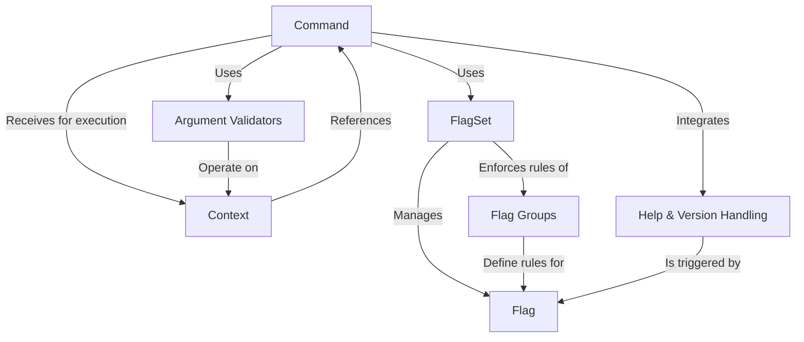

# Tutorial: prism

Prism is a Mojo framework for building **command-line interface (CLI)** applications.
It helps you create structured programs by defining **Commands**, which are like individual tasks or *recipes* your application can perform.
Each `Command` can accept **Flags** (options like `--verbose` or `-f`) to customize its behavior.
Prism handles parsing these flags and arguments, allows for *subcommands* (e.g., `git commit`), provides mechanisms for validating arguments, and automatically generates user-friendly **help** and **version** messages.

**Source Repository:** [None](None)

## Chapters

1. [Command
](01_command_.md)
2. [Flag
](02_flag_.md)
3. [FlagSet
](03_flagset_.md)
4. [Help & Version Handling
](04_help___version_handling_.md)
5. [Context
](05_context_.md)
6. [Argument Validators
](06_argument_validators_.md)
7. [Flag Groups
](07_flag_groups_.md)

---

Generated by [AI Codebase Knowledge Builder](https://github.com/The-Pocket/Tutorial-Codebase-Knowledge)